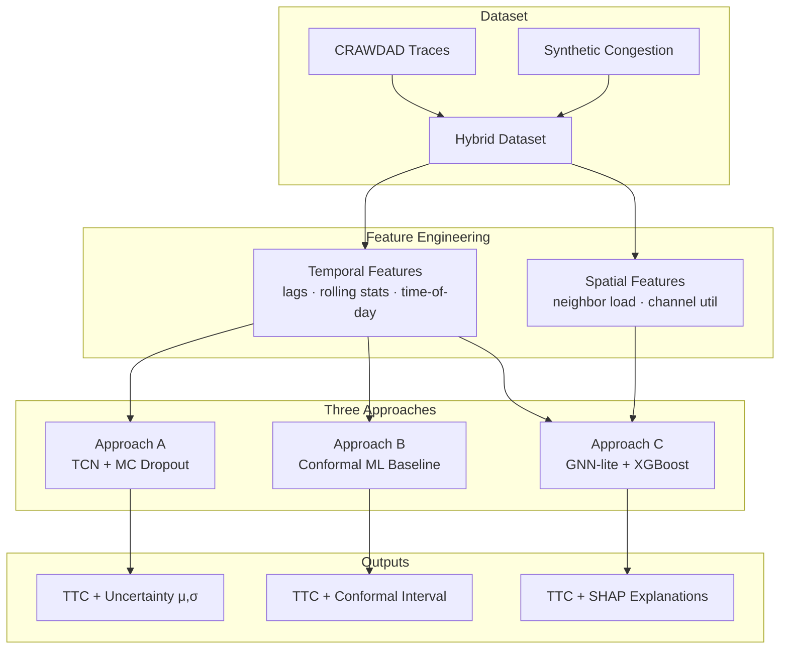

<div align="center">

# 📡 PredictiveAP

**Proactive Access Point Load Prediction using Temporal and Spatial Deep Learning**

[](https://www.python.org/)
[](https://pytorch.org/)
[](https://xgboost.readthedocs.io/)
[](https://jupyter.org/)

*Wireless Networks Coursework · IIITDM Kancheepuram · Team 5 – Cupcake*

[Overview](#-overview) • [Key Finding](#-key-finding) • [Dataset](#-dataset--features) • [Approaches](#-approaches) • [Results](#-results) • [Setup](#-setup)

</div>

---

## 📖 Overview

**PredictiveAP** is a framework for proactive wireless network management through **Time-to-Congestion (TTC) regression**. Rather than reacting to congestion after it occurs, PredictiveAP predicts — for each Access Point — how many future intervals remain before client load crosses a predefined threshold. This gives network controllers sufficient lead time to take corrective action (load balancing, soft handover, rate control) before service quality degrades.

Three complementary modelling approaches are designed and evaluated on a hybrid dataset of real CRAWDAD Wi-Fi traces and synthetic congestion events.

---

## 🔑 Key Finding

> **Temporal features dominate TTC prediction.** Lag statistics, rolling averages, and time-of-day patterns provide the vast majority of predictive signal. Spatial features from neighbouring APs — despite their theoretical appeal — provide negligible improvement on this dataset.

This is confirmed by three independent lines of evidence: ablation study, SHAP feature importance analysis, and cross-approach benchmarking.

---

## 🗄️ Dataset & Features

### Data Sources

The project uses a **hybrid dataset** combining two sources:

| Source | Description |
|---|---|
| **CRAWDAD Wi-Fi Traces** | Real university campus syslog data covering 3 days and 60,000+ client association/disassociation events |
| **Synthetic Congestion** | Artificially injected high-load spikes to ensure sufficient congestion examples for training |

Splits are strictly **chronological** to prevent temporal data leakage:

| Split | Samples |
|---|---|
| Train | ~19,500 |
| Validation | ~7,500 |
| Test (held-out) | 318 |

### Target Variable

**Time-to-Congestion (TTC)** — the number of future 30-second intervals until an AP's client count crosses the congestion threshold. Ranges from `0` (already congested) to `60` (comfortably below threshold). The target is `log1p`-transformed and Z-score normalised during training.

### Feature Groups

| Group | Features |
|---|---|
| **Temporal** | `hour_of_day`, `day_of_week`, `clients_lag1`, `clients_lag2`, `clients_roll5_mean`, `clients_roll5_std` |
| **Dynamic** | `clients_connected`, `clients_delta` |
| **Spatial** | `neighbor_avg_load`, `channel_utilization` |

---

## 🔬 Approaches

### Approach A — Temporal Convolutional Network + MC Dropout

The core idea is to treat each AP's load history as a time series and learn from it using a deep temporal model. A TCN looks at the last 10 minutes of data (20 time steps) and uses dilated convolutions to pick up patterns at multiple timescales — from sudden spikes to gradual daily trends.

To go beyond a plain prediction, **MC Dropout** runs the model 50 times at inference with dropout active, producing a mean estimate and an uncertainty band. This tells the network controller not just *when* congestion is expected, but *how confident* the model is — useful for deciding whether to act or wait.

---

### Approach B — Conformal Prediction Baseline

The idea here is simpler: use a standard ML model (Random Forest or XGBoost) on the current snapshot of features — no sequence, no history — and wrap it with a **conformal predictor** that guarantees a statistically valid 90% prediction interval regardless of the underlying model or data distribution.

This acts as a sanity check: how much does modelling temporal history actually help over a well-calibrated snapshot model?

---

### Approach C — GNN-lite + XGBoost Ensemble

This approach tests whether knowing what your *neighbouring APs* are doing helps predict your own congestion. A lightweight graph layer aggregates the load of nearby APs into a spatial context vector, which is then combined with the usual temporal features and fed into an XGBoost model.

**SHAP analysis** is used to explain which features actually matter, and an **ablation study** compares the spatial+temporal model against a temporal-only version to measure the real contribution of the graph features.

---

## 📊 Results

### Test Set Performance

| Approach | MAE ↓ | RMSE ↓ | R² ↑ | Coverage (90%) |
|---|---|---|---|---|
| **A — TCN + MC Dropout** ⭐ | **0.45** | **0.52** | **0.71** | 100.0% |
| B — Conformal ML | 5.15 | 6.82 | 0.67 | 90.0% |
| C — Temporal Only (XGBoost) | 7.02 | 9.11 | 0.65 | 77.2% |
| C — Temporal+Spatial (XGBoost) | 7.11 | 9.13 | 0.65 | 78.7% |

> Approach A metrics are on the `log1p` normalised target scale; XGBoost models evaluate on the raw TTC target.

### Trade-off Summary

| Approach | Strengths | Weaknesses | Best For |
|---|---|---|---|
| **A (TCN)** | Best accuracy; uncertainty-aware; captures temporal depth | Requires sequence history; higher compute | Production controllers |
| **B (Conformal)** | Simple; guaranteed coverage; fast inference | Lower accuracy; no temporal depth | Lightweight deployments |
| **C (XGBoost)** | Interpretable (SHAP); spatial-extensible; fast train/infer | No deep uncertainty; spatial provides no gain here | Analysis & insight |

### Why Spatial Features Fall Short

Adding GNN-lite spatial features provides **no meaningful improvement** over the temporal-only baseline (MAE: 7.02 → 7.11). This is due to:

- Client trajectories are not directly observable in syslog data; neighbour load is only an indirect mobility proxy
- At 30-second aggregation granularity, within-AP temporal autocorrelation dominates cross-AP spatial correlation
- CRAWDAD campus APs have loads driven by fixed room occupancy cycles, not client roaming

Spatial features may prove more useful in high-mobility environments such as stadiums or transit hubs.

---

## 🏗️ Architecture Overview



---

## 💻 Setup

### Prerequisites

- Python 3.8+
- Jupyter Notebook / JupyterLab
- Git

### 1. Clone the Repository

```bash
git clone https://github.com/Sohanuu66/PredictiveAP.git
cd PredictiveAP
```

### 2. Create a Virtual Environment

```bash
python -m venv .venv

# macOS / Linux
source .venv/bin/activate

# Windows
.venv\Scripts\activate
```

### 3. Install Dependencies

```bash
pip install -r requirements.txt
```

### 4. Run the Notebooks

Execute the Jupyter Notebooks **sequentially**:

| Notebook | Description |
|---|---|
| `Notebook_1` | Dataset construction & feature engineering |
| `Notebook_2` | Approach A — TCN + MC Dropout |
| `Notebook_3` | Approach B — Conformal Prediction Baseline |
| `Notebook_4` | Approach C — GNN-lite + XGBoost + SHAP |
| `Notebook_5` | Results comparison & visualisations |

> [!NOTE]
> Raw CRAWDAD data in `assets/data/` is not included in the repository. Run **Notebook 1 first** to download and process the dataset before proceeding to model training.

---

## 📁 Project Structure

```
PredictiveAP/
│
├── notebooks/
│   ├── Notebook_1_Dataset.ipynb
│   ├── Notebook_2_TCN.ipynb
│   ├── Notebook_3_Conformal.ipynb
│   ├── Notebook_4_XGBoost_SHAP.ipynb
│   └── Notebook_5_Results.ipynb
│
├── assets/
│   └── data/               # CRAWDAD traces (downloaded at runtime)
│
├── outputs/
│   └── checkpoints/        # Saved model weights
│
├── requirements.txt
└── README.md
```

---

## 👥 Team Contributions

| Member | Roll No. | Contributions |
|---|---|---|
| **Sohan** | CS23B1004 | Approach A (TCN), Approach C (GNN-lite + XGBoost), model design & results integration |
| **Shishir** | CS23B2043 | Dataset strategy, feature engineering, hybrid dataset construction, model experimentation |
| **Revanth Kolla** | CS23B1085 | SHAP interpretability, feature importance analysis, cross-model evaluation |
| **Sevith Illa** | CS23I1041 | Debugging, testing, model validation, presentation preparation |

*Report writing and presentation were collaborative across all members.*

---

## 📚 References

1. Bai et al., *"An empirical evaluation of generic convolutional and recurrent networks for sequence modeling"*, arXiv:1803.01271, 2018.
2. Gal & Ghahramani, *"Dropout as a Bayesian approximation"*, ICML 2016.
3. Lundberg & Lee, *"A unified approach to interpreting model predictions"*, NeurIPS 2017.
4. Angelopoulos & Bates, *"A gentle introduction to conformal prediction"*, arXiv:2107.07511, 2021.

---

## 📜 License

Submitted as coursework for the Wireless Networks course at IIITDM Kancheepuram. For academic use only.
